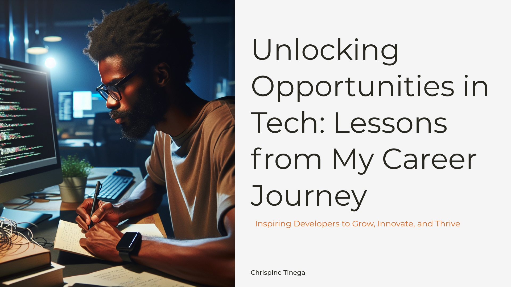

# Unlocking Opportunities in Tech: Lessons from My Career Journey

A presentation by Chrispine Tinega inspiring developers to grow, innovate, and thrive in the tech industry.

## Overview

This repository contains the slides, resources, and key lessons from the presentation. It is a roadmap for developers and tech enthusiasts to unlock their potential and explore the vast opportunities in the tech world.

## Contents

- [Presentation Slides](slides/Chrispine Tinega - A Journey in Technology Unlocking Opportunities for Developers.pptx)
- [Key Takeaways](#key-takeaways)
- [Resources for Developers](resources/)
- [Get in Touch](#get-in-touch)

## Key Takeaways

1. **Curiosity is the spark of growth:** Embrace your curiosity and explore the unknown.
2. **Continuous learning is essential:** Stay updated with trends and build versatile skills.
3. **Take risks and seize opportunities:** Push your boundaries to achieve growth.

## Resources

Check out the [resources folder](resources/) for:

- Further reading on tech trends and skills.
- Links to platforms like GitHub, LinkedIn, and coding challenges.
- Sample projects to inspire your journey.

## Get in Touch

Feel free to connect with me:

- [LinkedIn](https://www.linkedin.com/in/tinegachris)
- [GitHub](https://github.com/tinegachris)
- [Website](https://chrispinetinega.com)

## License

This repository is licensed under the MIT License - see the [LICENSE](LICENSE) file for details.
